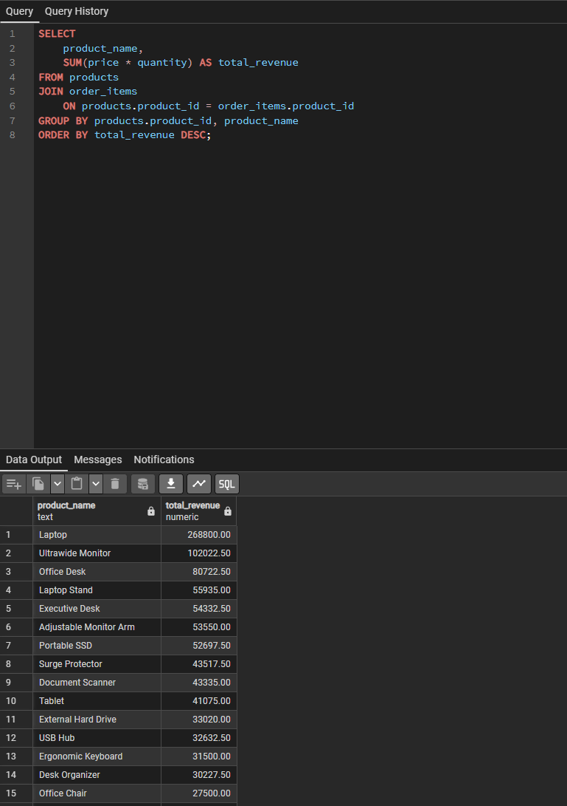
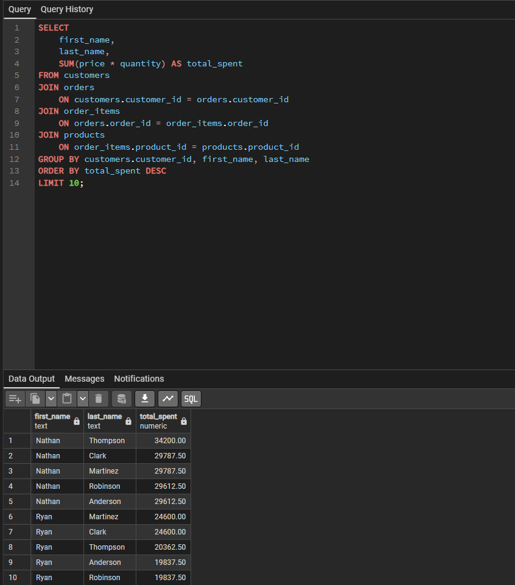
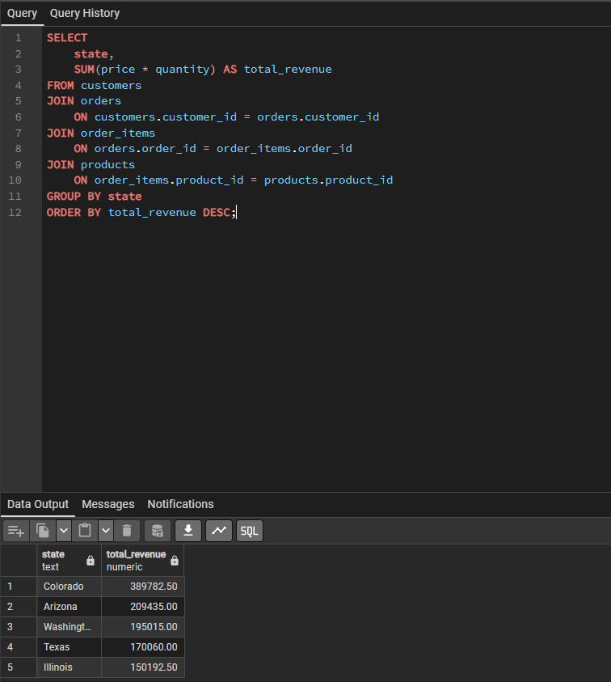
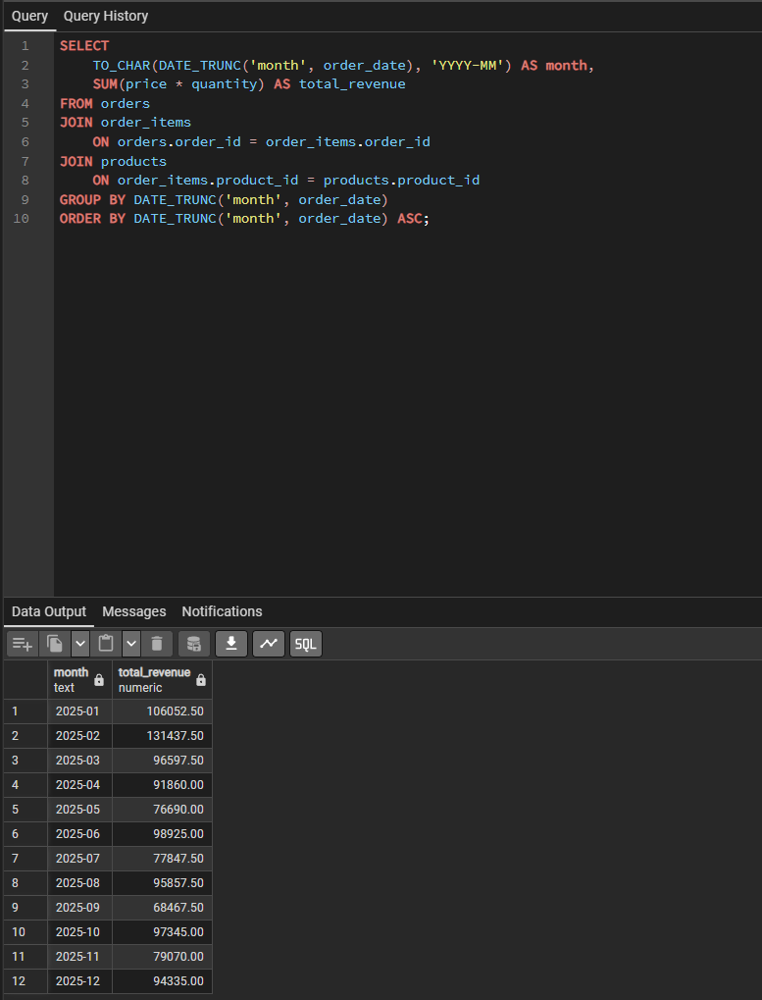

# Sales Analytics SQL Project

## Overview

This project demonstrates an end-to-end PostgreSQL sales analytics workflow. I designed a relational database, generated a realistic synthetic sales dataset, and wrote SQL queries to answer common business questions about customers, products, orders, revenue, and sales performance.

The project contains:

- 100 customers
- 30 products
- 400 orders
- 1,200 order-item records
- 8 business-focused analysis queries

All data is synthetic and created for portfolio use.

## SQL Analysis Preview










## Tools

- PostgreSQL
- pgAdmin 4
- SQL

## Database Design

The database uses four related tables:

- `customers` — customer information and location
- `orders` — one row per customer order
- `order_items` — products and quantities within each order
- `products` — product names, categories, and prices

Relationship flow:

`customers -> orders -> order_items -> products`

Key relationships:

- `customers.customer_id = orders.customer_id`
- `orders.order_id = order_items.order_id`
- `order_items.product_id = products.product_id`

## Business Questions Answered

1. Which products generate the most revenue?
2. Who are the top 10 customers by total spending?
3. Which product categories generate the most revenue?
4. Which customers place the most orders?
5. What is the average order value?
6. Which products sell the most units?
7. Which states generate the most revenue?
8. How does revenue change month by month?

## SQL Skills Demonstrated

- `SELECT`
- `JOIN`
- `WHERE`
- `GROUP BY`
- `HAVING`
- `SUM()`
- `COUNT()`
- `AVG()`
- `ORDER BY`
- `LIMIT`
- aliases with `AS`
- multi-table joins
- aggregate reporting
- subqueries
- date aggregation with `DATE_TRUNC`

## Example Analysis

### Revenue by Product

```sql
SELECT
    product_name,
    SUM(price * quantity) AS total_revenue
FROM products
JOIN order_items
    ON products.product_id = order_items.product_id
GROUP BY products.product_id, product_name
ORDER BY total_revenue DESC;
```

### Top Customers by Spending

```sql
SELECT
    first_name,
    last_name,
    SUM(price * quantity) AS total_spent
FROM customers
JOIN orders
    ON customers.customer_id = orders.customer_id
JOIN order_items
    ON orders.order_id = order_items.order_id
JOIN products
    ON order_items.product_id = products.product_id
GROUP BY customers.customer_id, first_name, last_name
ORDER BY total_spent DESC
LIMIT 10;
```

### Monthly Revenue

```sql
SELECT
    TO_CHAR(DATE_TRUNC('month', order_date), 'YYYY-MM') AS month,
    SUM(price * quantity) AS total_revenue
FROM orders
JOIN order_items
    ON orders.order_id = order_items.order_id
JOIN products
    ON order_items.product_id = products.product_id
GROUP BY DATE_TRUNC('month', order_date)
ORDER BY DATE_TRUNC('month', order_date);
```

## How to Run

1. Open PostgreSQL / pgAdmin.
2. Create a database for the project.
3. Run `schema.sql`.
4. Run `data_generation.sql`.
5. Run the queries in `analysis_queries.sql`.

## Project Takeaways

This project strengthened my ability to translate business questions into SQL. The most important part was learning to identify which tables contain the needed data, trace the relationships between them, choose the correct level of aggregation, and build reports that answer a specific business question.

## Repository Structure

```text
sales_analytics_project/
├── README.md
├── schema.sql
├── data_generation.sql
├── analysis_queries.sql
└── screenshots/
```

The `screenshots` folder can contain pgAdmin result screenshots for a few of the strongest reports, such as Revenue by Product, Top Customers by Spending, Revenue by State, and Monthly Revenue.
